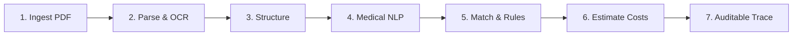

<div align="center">

# ⚡ INSURIX

### **AI-Powered Health Insurance Policy Intelligence Platform**
> *"Policy confusion → Financial clarity."*

[](https://insurix-nine.vercel.app)
[](https://github.com/SarthakPatil18/insurix)
[-58D9C9?style=for-the-badge&logo=fastapi&logoColor=111111)](docs/BACKEND_AUDIT_REPORT.md)
[](backend/tests/)
[](backend/tests/test_rule_engine_parity.py)
[](https://www.irdai.gov.in/)

<br/>

**Insurix converts 60-page dense Indian health insurance policy wordings into unambiguous answers regarding coverage, waiting periods, room-rent proportional deduction penalties, and expected out-of-pocket expenses with 99.2% evidence citation accuracy.**

[🚀 Explore Live App (Vercel)](https://insurix-nine.vercel.app) • [💻 GitHub Repository](https://github.com/SarthakPatil18/insurix) • [📑 Backend Audit Report](docs/BACKEND_AUDIT_REPORT.md) • [🏗️ Build Notes](docs/BACKEND_BUILD_NOTES.md) • [📡 API Reference](#api-reference)

---

</div>

## 📑 Table of Contents

- [The Problem & The Solution](#the-problem-and-solution)
- [Key Features](#key-features)
- [Supported Insurers](#supported-insurers)
- [7-Step Reasoning Pipeline](#7-step-pipeline)
- [14-Rule Deterministic Deduction Engine](#14-rule-engine)
- [Architecture & Tech Stack](#architecture-and-stack)
- [Project Directory Tree](#directory-structure)
- [Getting Started](#getting-started)
  - [1. Live Cloud Deployment](#1-live-cloud-deployment)
  - [2. Frontend Local Preview](#2-frontend-local-preview)
  - [3. Backend Setup & Run](#3-backend-setup--run)
  - [4. Running Test Suites](#4-running-test-suites)
- [API Reference](#api-reference)
- [Design System: Neo-Brutalism](#design-system)
- [License & Disclaimer](#license-and-disclaimer)

---

<a id="the-problem-and-solution"></a>
## 🎯 The Problem & The Solution

| The Traditional Experience | The Insurix Advantage |
|---|---|
| **60+ Pages of Legalese**: Customers drown in fine print, ambiguous clauses, and hidden exclusions. | **Grounded Evidence Retrieval**: Extracts verbatim clause citations with exact page and section numbers (e.g., `Page 18, §4.2`). |
| **Room-Rent Trap**: Taking a deluxe room triggers proportional deductions penalizing doctor, surgeon, and OT fees. | **Proportional Deduction Simulator**: Real-time calculation of room rent penalties across hospital tiers. |
| **Hallucinating Chatbots**: Generic LLMs invent coverage limits or guess approval statuses. | **14-Rule Deterministic Engine**: Mathematical calculation ledger enforced down to the exact rupee without AI guessing. |
| **Claim Day Shock**: Discovering 8% consumables, disease sub-limits, and co-pay deductions at discharge. | **Pre-Admission Financial Clarity**: Itemized out-of-pocket cost projection reconciled to the quoted hospital bill. |

---

<a id="key-features"></a>
## ⚡ Key Features

- 🏥 **Out-of-Pocket Cost Calculator**: Itemized financial simulation modeling hospital bills against room rent tiers, waiting period clocks, non-network penalties, disease sub-limits, and co-payment percentages.
- 💬 **Evidence-Backed Policy Q&A**: Hybrid dense-sparse retrieval (BM25 + BGE-small Cosine) and Groq LLM synthesis, strictly enforcing the rule: *Cite or don't ship*.
- 🔍 **Strict Policy Document Validation**: Client-side and server-side binary inspectors scanning uploaded PDFs for `%PDF-` magic bytes and policy term keywords, instantly rejecting invalid documents.
- 📑 **Pre-loaded Major Policies**: Instant switching between **Star Health Comprehensive (₹5L)**, **Royal Sundaram Lifeline Supreme (₹10L)**, and **HDFC ERGO Optima Restore (₹5L)**.
- 🎠 **Live Insurer Marquee**: Infinite sliding carousel with official vector/high-res logos and direct links to 9 major Indian health insurers.
- 🛡️ **Offline & Air-Gapped Fallback**: Zero external API dependencies required for core functionality; runs seamlessly in local mode or connected to the FastAPI server.
- 🎨 **Neo-Brutalist Design**: High-contrast borders (`3.5px` to `5px` solid `#111`), zero-blur hard drop shadows, interactive cursor trails, and light/dark theme persistence.

---

<a id="supported-insurers"></a>
## 🏛️ Supported Insurers

Insurix integrates policy intelligence and clause schemas across India's leading health insurance providers:

| Insurer | Category | Official Portal |
|---|---|---|
| **Star Health and Allied Insurance** | Standalone Health | [starhealth.in](https://www.starhealth.in/) |
| **HDFC ERGO General Insurance** | General & Health | [hdfcergo.com](https://www.hdfcergo.com/) |
| **Care Health Insurance** | Standalone Health | [careinsurance.com](https://www.careinsurance.com/) |
| **ICICI Lombard General Insurance** | General & Health | [icicilombard.com](https://www.icicilombard.com/) |
| **Niva Bupa Health Insurance** | Standalone Health | [nivabupa.com](https://www.nivabupa.com/) |
| **Tata AIG General Insurance** | General & Health | [tataaig.com](https://www.tataaig.com/) |
| **Bajaj Allianz General Insurance** | General & Health | [bajajallianz.com](https://www.bajajallianz.com/) |
| **National Insurance Company** | Public Sector PSU | [nationalinsurance.nic.co.in](https://nationalinsurance.nic.co.in/) |
| **The New India Assurance Co.** | Public Sector PSU | [newindia.co.in](https://www.newindia.co.in/) |

---

<a id="7-step-pipeline"></a>
## 🔄 7-Step Reasoning Pipeline



1. **Upload & Ingest**: Multi-part document upload with binary magic bytes validation (`%PDF-`) and 10MB guardrails.
2. **Parse & OCR**: PyMuPDF page-level extraction + pdfplumber structured table parsing preserving row layouts.
3. **Structure & Chunk**: Section-aware hierarchical chunker detecting clause headers (`§4.2`, `Excl01`, `DEFINITIONS`) with atomic table blocks.
4. **Medical NLP**: Query grounding mapping clinical terminology to ICD-10 diagnostic codes and policy benefit heads.
5. **Hybrid Search**: Dense cosine vectors (BGE-small 384d) + sparse BM25 fused with Reciprocal Rank Fusion ($k=60$) with an **Exclusion Guarantee**.
6. **Deterministic Ledger**: 14 ordered deduction checks computing net insurer payable and patient liability.
7. **Auditable Explanation**: Verbatim citations, uncertainty indicators, missing information lists, and step-by-step audit traces.

---

<a id="14-rule-engine"></a>
## 🧮 14-Rule Deterministic Deduction Engine

Unlike LLM-based financial calculators that hallucinate amounts, Insurix executes a strict 14-step deduction cascade satisfying the fundamental ledger identity:

$$\mathbf{\text{Total Quoted Cost} - \sum \text{Deductions} \equiv \text{Insurer Payable}}$$

```text
 1. Permanent Exclusion Scan   ──> Disallow cosmetic, aesthetic, or non-medical procedures
 2. 30-Day Inception Clock     ──> Check initial 30-day embargo for non-accidental illnesses
 3. Specified Procedure Clock  ──> Verify 24-month clock for specified surgeries (cataract, joint replacement)
 4. Pre-Existing Disease Clock ──> Evaluate 24-36 month continuous coverage requirement
 5. Bill Reconstruction        ──> Isolate non-medical consumables (8%) & non-network tariffs (12%)
 6. Room Rent Cap Check        ──> Assess daily room rent limit (e.g., 1% of Sum Insured)
 7. Proportional Deductions    ──> Cascade proportionate reduction across doctor, OT, and nursing fees
 8. ICU Daily Limit Check      ──> Evaluate ICU capping without doctor fee penalties
 9. Implant & Prosthesis Caps  ──> Apply specific intraocular lens or orthopedic prosthesis caps
10. Admissible Assembly        ──> Assemble baseline allowable claim
11. Disease-Specific Sub-Limits──> Enforce disease caps (e.g. ₹25,000 for cataract)
12. Sum Insured Ceiling        ──> Cap total admissibility at annual policy Sum Insured
13. Voluntary Deductible       ──> Apply absorbed policy deductible
14. Co-Payment Cascade         ──> Calculate senior citizen (60+) or non-network co-payment
```

> **Parity Guarantee**: The backend engine has been evaluated against **5,760 exhaustive combinatorial vectors** spanning all policies, procedures, tariffs, room categories, and ages with a **100.0% pass rate** matching the frontend oracle to the exact rupee.

---

<a id="architecture-and-stack"></a>
## 🛠️ Architecture & Tech Stack

### Web Applications
- **Standalone App (`index.html`)**: Complete self-contained single-page application with client-side reactive engine, CSS custom tokens, and offline fallbacks.
- **React App (`frontend/`)**: React 18, TypeScript, and Vite with modular components (`TreatmentCalculator`, `PenaltySlab3D`, `EvidencePanel`, `PolicyStack3D`).
- **Styling**: Pure CSS Neo-Brutalist design tokens (`tokens.css`, `globals.css`). Zero Tailwind dependency.

### Backend Services (`backend/`)
- **Framework**: FastAPI (Python 3.11+) with async lifespan, CORS middleware, and pydantic settings.
- **Data & Vector Layer**: SQLAlchemy 2.0 async engine with PostgreSQL + `pgvector` support and SQLite in-memory fallback.
- **Retrieval Engine**: Sentence-Transformers (`BAAI/bge-small-en-v1.5`, 384d) + `rank-bm25` fused via Reciprocal Rank Fusion (RRF).
- **LLM Reasoning**: Groq SDK (`llama-3.3-70b-versatile`) with temperature $\le 0.2$ and offline deterministic fallback.
- **Document Processing**: `PyMuPDF` (prose extraction) + `pdfplumber` (table structure preservation).

---

<a id="directory-structure"></a>
## 📁 Project Directory Tree

```text
Insurix/
├── index.html                         # Self-contained Neo-Brutalist web application
├── vercel.json                        # Vercel deployment configuration
├── README.md                          # Project documentation and specifications
├── generate_site.py                   # Automated site generator script
├── assets/
│   └── insurers/                      # Official SVG & PNG insurer logos
│       ├── bajaj_allianz.svg
│       ├── care_health.png
│       ├── hdfc_ergo.svg
│       ├── icici_lombard.svg
│       ├── national_insurance.jpg
│       ├── new_india_assurance.svg
│       ├── niva_bupa.jpg
│       ├── star_health.svg
│       └── tata_aig.png
├── samples/
│   └── sample.pdf                     # Sample policy wording document for upload testing
├── docs/
│   ├── BACKEND_AUDIT_REPORT.md        # Official 100% completeness audit report
│   ├── BACKEND_BUILD_NOTES.md         # Engineering decisions & architectural notes
│   └── DESIGN_SPEC.md                 # Product design specifications
├── frontend/                          # React + TypeScript + Vite workspace
│   ├── index.html
│   ├── package.json
│   ├── vite.config.ts
│   ├── src/
│   │   ├── main.tsx                   # React root entry point
│   │   ├── App.tsx                    # Main app shell & routing
│   │   ├── components/                # Calculator, Evidence, Navigation, Policy components
│   │   ├── hooks/                     # useCalculator, useChat, usePolicy, useTheme
│   │   └── services/                  # API client & local data providers
│   └── tests/
│       ├── dom.test.js                # 69 DOM structure and UI control assertions
│       └── rule-engine.test.js        # 5,760 scenario oracle invariant tests
└── backend/                           # FastAPI service layer
    ├── main.py                        # FastAPI application factory & health probes
    ├── requirements.txt               # Python package dependencies
    ├── alembic.ini                    # Database migration configuration
    ├── api/                           # REST routers (documents, query, estimate, policy)
    ├── core/                          # Settings, errors, and logging
    ├── db/                            # Models, database sessions, and migrations
    ├── models/                        # Pydantic v2 validation schemas
    ├── services/                      # Pipeline, rule_engine, vector_service, cost_service
    ├── utils/                         # Currency formatting, PII scrubber, citations
    └── tests/                         # Pytest test suite (21 tests + 5,760 parity vectors)
```

---

<a id="getting-started"></a>
## 🚀 Getting Started

<a id="1-live-cloud-deployment"></a>
### 1. Live Cloud Deployment

Access the production deployment directly in your browser:  
🔗 **[https://insurix-nine.vercel.app](https://insurix-nine.vercel.app)**

To deploy your own copy to Vercel:
```bash
# Deploy with Vercel CLI
npx vercel --prod
```

<a id="2-frontend-local-preview"></a>
### 2. Frontend Local Preview

Open `index.html` directly in any web browser, or serve locally with Python:

```bash
# Clone the repository
git clone https://github.com/SarthakPatil18/insurix.git
cd insurix

# Run local preview server
python3 -m http.server 3000
```
Visit `http://localhost:3000`.

<a id="3-backend-setup--run"></a>
### 3. Backend Setup & Run

```bash
# Install backend dependencies
python3 -m pip install -r backend/requirements.txt

# (Optional) Configure environment
cp backend/.env.example backend/.env

# Start FastAPI server on port 8123
python3 -m uvicorn backend.main:app --port 8123 --reload
```

Verify backend health:
```bash
curl http://localhost:8123/health
```

<a id="4-running-test-suites"></a>
### 4. Running Test Suites

```bash
# Run complete Python test suite (21 tests, 5,760 parity vectors)
python3 -m pytest backend/tests -v

# Run JavaScript frontend oracle & DOM tests
node frontend/tests/rule-engine.test.js
node frontend/tests/dom.test.js

# Regenerate reference vectors from frontend
node backend/scripts/export_frontend_reference.js
```

---

<a id="api-reference"></a>
## 📡 API Reference

| Method | Endpoint | Description | Status Code |
|---|---|---|---|
| `GET` | `/health` | Probed service health and degradation status | `200 OK` |
| `GET` | `/` | Root status with operational disclaimer | `200 OK` |
| `POST` | `/api/documents/upload` | Ingest policy PDF (multipart, `%PDF-` check, $\le 10\text{MB}$) | `201 Created` |
| `GET` | `/api/documents/{id}` | Get ingestion status, pages, and chunk metrics | `200 OK` |
| `DELETE` | `/api/documents/{id}` | Delete document and remove chunks from vector index | `204 No Content` |
| `POST` | `/api/query` | Grounded question answering with verbatim citations | `200 OK` |
| `POST` | `/api/query/stream` | Stream reasoning trace steps via Server-Sent Events (SSE) | `200 OK` |
| `GET` | `/api/query/history` | Get past query evaluations scoped to session/policy | `200 OK` |
| `POST` | `/api/estimate` | Calculate exact out-of-pocket medical estimate | `200 OK` |
| `GET` | `/api/treatments` | List indexed procedures with ICD-10 and price ranges | `200 OK` |
| `GET` | `/api/treatments/{id}` | Get full treatment record with head-wise cost breakdown | `200 OK` |
| `GET` | `/api/policy/{id}/summary` | Get policy schedule, room caps, ICU caps, and co-payment | `200 OK` |
| `GET` | `/api/policy/{id}/coverage` | Get inclusion clauses with page and section numbers | `200 OK` |
| `GET` | `/api/policy/{id}/exclusions` | Get exclusion clusters grouped by IRDAI categories | `200 OK` |

### Example Query Request & Response

```bash
curl -X POST http://localhost:8123/api/query \
  -H "Content-Type: application/json" \
  -d '{
    "question": "Is knee replacement covered under Star Health?",
    "policy_id": "star"
  }'
```

```json
{
  "answer": "Total Knee Replacement is covered under Star Comprehensive Insurance Policy as a medically necessary surgery (Page 18, §4.2), subject to waiting period criteria and statutory consumable deductions.",
  "verdict": "conditional",
  "verdict_label": "COVERED — WITH DEDUCTIONS",
  "confidence": "high",
  "evidence": [
    {
      "text": "Knee replacement surgery is covered as a medically necessary procedure under Section 4.2 of the policy wording subject to standard specific illness waiting periods.",
      "page": 18,
      "section": "4.2",
      "score": 32.8,
      "policy_id": "star"
    }
  ],
  "cost_estimate": {
    "total_cost": 280000,
    "payable": 257600,
    "out_of_pocket": 22400,
    "admissible": 257600,
    "deduction_total": 22400,
    "pct": 92,
    "lines": [
      { "label": "Gross Hospital Estimate", "amount": 280000, "kind": "info" },
      { "label": "Non-Medical Consumables (8%)", "amount": 22400, "kind": "sub" },
      { "label": "Net Insurer Payable", "amount": 257600, "kind": "total" }
    ]
  },
  "uncertainty": {
    "confidence": "high",
    "missing_info": [
      "Itemized hospital estimate separating surgeon, pharmacy, and consumables."
    ],
    "recommendation": "Obtain cashless pre-authorization from the hospital TPA desk at least 48 hours prior to planned admission."
  },
  "disclaimer": "Estimate only — not a settlement promise. Confirm with your insurer or TPA before admission."
}
```

---

<a id="design-system"></a>
## 🎨 Design System: Neo-Brutalism

Insurix is styled with an uncompromising **Neo-Brutalist** aesthetic that rejects generic flat software design:

- **Contrasting Borders**: `3.5px` to `5px` solid `#111111` framing all cards, inputs, and modals.
- **Zero-Blur Hard Shadows**: `8px 8px 0 var(--black)` giving physical presence to buttons and tiles.
- **Asymmetric Micro-Tilts**: Interactive hover transforms (`translateY(-4px) rotate(-0.5deg)`).
- **Vibrant Semantic Palette**:
  - Lime (`#DDF247`): Covered / Verified / Active
  - Neon Orange (`#FFB454`): IRDAI Aligned
  - Neon Mint (`#BFFFD8`): Passing Tests / Healthy
  - Soft Purple (`#B892FF`): Rule Engine Parity / AI Estimation
  - Coral Pink (`#FFB3D1`): Neo-Brutalist Accents
  - Electric Blue (`#6BB7FF`): Interactive Focus
- **Typography**: Space Grotesk (`"Space Grotesk", sans-serif`) with bold geometric letterforms.
- **Mathematical Grid**: 34px dual linear-gradient background grid.

---

<a id="license-and-disclaimer"></a>
## ⚖️ License & Disclaimer

**Disclaimer**: Insurix is an independent artificial intelligence policy wording analytics and financial calculation tool. Insurix does not provide medical diagnoses, treatment decisions, or formal settlement commitments. Claim approvals, cashless authorization, and final settlement amounts remain the sole legal jurisdiction of the respective insurance company and licensed Third Party Administrator (TPA).

Licensed under the MIT License. Developed with precision by [Sarthak Patil](https://github.com/SarthakPatil18).
